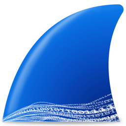

# Hello, World!👋, I'm Jun Hua
* 👨‍💻 A Computer Engineering Student
* ⛲ Passionate about Protecting Digital Infrastructure 
* 🌱 I’m currently learning basics of Cyber Security

## ⚙️ Technologies | Tools | Languages   
<!-- Technologies/Platforms -->

 <!-- Development Tools -->

 <!-- Programming Languages -->

<!--  -->

